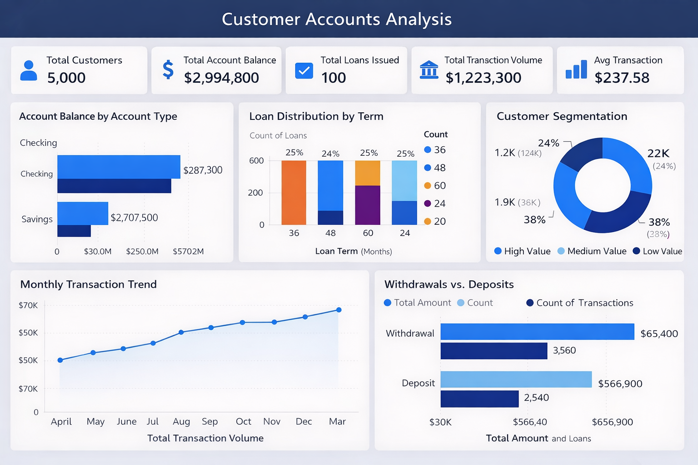

# 🚀 Project 1 – Enterprise-Grade Customer Account Data Pipeline (Azure)

## 📌 Overview

This project demonstrates the design and implementation of a production-ready Azure data pipeline built using modern cloud data engineering best practices.

The solution ingests raw banking datasets, processes them through a Medallion Architecture (Bronze → Silver → Gold), and delivers curated data into Azure SQL Database for analytics and reporting.

Designed with scalability, modularity, and enterprise-grade standards in mind.

---

## 🏗 Architecture Overview

### ETL Workflow

The pipeline follows the Medallion Architecture pattern:

- **Bronze Layer (Raw)** – Immutable raw data ingestion  
- **Silver Layer (Cleaned)** – Standardized, validated, transformed data  
- **Gold Layer (Curated)** – Business-ready dimensional model  

---

## 🎯 Business Objective

Build a scalable Azure-based ETL framework to:

- Ingest structured banking datasets from backend storage
- Perform cleansing and schema standardization
- Apply business transformation logic including SCD Type 1 & Type 2
- Load curated datasets into Azure SQL Database
- Enable downstream reporting through Power BI

---

# 🔄 End-to-End Data Engineering Workflow

## 🟤 Step 1: Data Ingestion (Source → Bronze Layer)

**Source**
- Local File System  
- Files:
  - accounts.csv
  - customers.csv
  - loan_payments.csv
  - loans.csv
  - transactions.csv

**Dataset Reference**
- AI Bank Dataset (Kaggle)

**Implementation**
- Built parameterized Azure Data Factory pipelines
- Ingested raw files into Azure Data Lake Storage Gen2 (Bronze container)
- Designed ingestion framework for scalability and reusability

**Design Considerations**
- Schema drift handling
- Re-runnable pipeline logic
- Folder-based partitioning strategy
- Metadata-driven ingestion

---

## ⚪ Step 2: Data Cleansing (Bronze → Silver Layer)

Data transformation implemented using Azure Data Factory Mapping Data Flows:

- Removed duplicate records
- Handled missing/null values
- Applied schema validation
- Standardized column naming conventions
- Performed data type transformations
- Output written in optimized Parquet/Delta format

The Silver layer acts as a trusted, validated data zone.

---

## 🟡 Step 3: Data Transformation (Silver → Gold Layer)

Applied business logic and dimensional modeling principles:

### Key Implementations

- SCD Type 1 (Overwrite strategy)
- SCD Type 2 (Historical tracking with effective & expiry dates)
- Surrogate key generation
- Fact and dimension table modeling
- Referential integrity enforcement

Final curated data loaded into:

➡ **Azure SQL Database**

Designed for:
- Optimized query performance
- BI consumption
- Structured relational analytics

---

## 🔁 Pipeline Orchestration

Three modular pipelines were developed:

1. Local → Bronze
2. Bronze → Silver
3. Silver → Gold

### Features

- Parameterized datasets
- Dynamic pipeline execution
- Trigger-based scheduling
- Dependency chaining
- Centralized monitoring
- Secure secret management via Azure Key Vault

---

## 📊 Data Visualization

### Dashboard

- Connected Power BI to Azure SQL Database
- Designed dashboards for:
  - Customer Account Analysis
  - Loan Performance Metrics
  - Transaction Insights
- Published reports to Microsoft Fabric Workspace

---

# ⚙️ Key Engineering Highlights

- Medallion architecture implementation
- Modular and reusable pipeline design
- Secure credential management using Azure Key Vault
- Scalable storage using Parquet/Delta format
- Business-driven dimensional modeling
- Production-ready orchestration framework

---

# 🛠 Technology Stack

- Azure Data Factory
- Azure Data Lake Storage Gen2
- Azure SQL Database
- Azure Key Vault
- Power BI
- Parquet / Delta Lake

---

## 💡 What This Project Demonstrates

This project reflects hands-on experience in:

- Designing scalable cloud-native data architectures
- Building enterprise-grade ETL/ELT pipelines
- Implementing SCD logic in Azure
- Dimensional modeling for analytics
- Secure and maintainable data engineering solutions

---

## 🔗 Connect With Me

LinkedIn: https://www.linkedin.com/in/aniketh8/

---

Thank you for reviewing this project.
